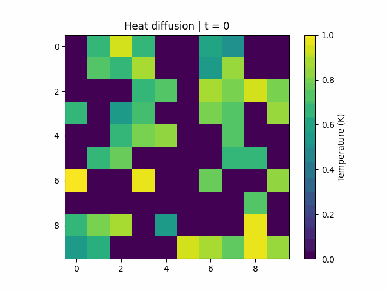
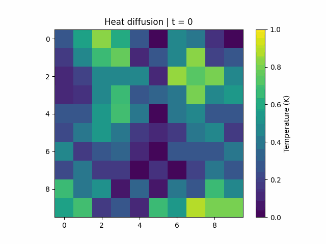
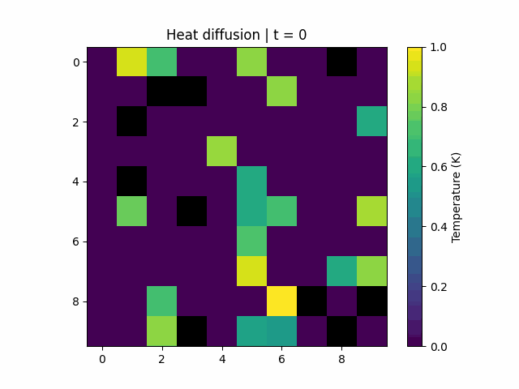
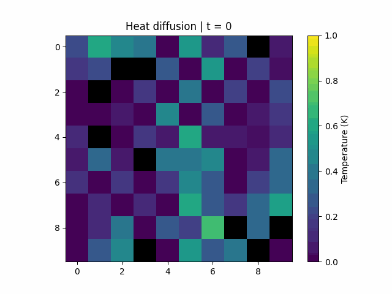
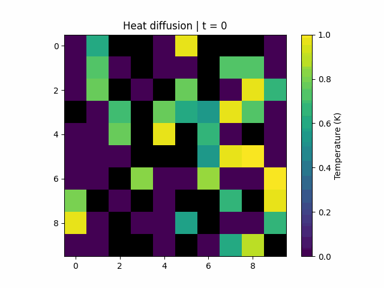
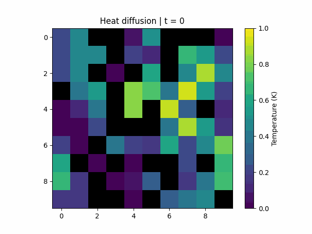
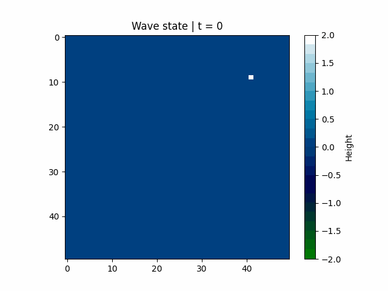
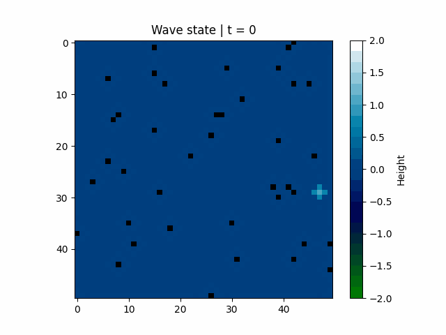
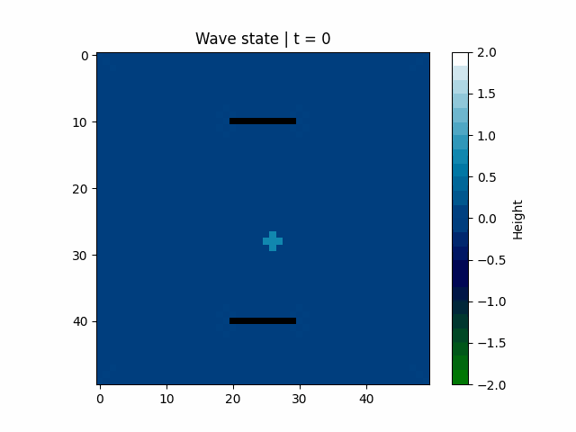

# Project paper work

This contains the illustrations to the project paper regarding predictions of dynalmical systems with Graph neural networks. The experiments are done on heat diffusion and wave propagation systems.

Note that some illustrations might be innacurate due to bugs in matplotlib.

_Heat diffusion_

Here is a heat diffusion for a longer time period with a larger graph for illustration purposes.

Data:

With 10x10 grid graph

Test data:

Graph network prediction:

With 10x10 grid graph with 10 disconnected nodes

Test data:

Graph network prediction:

With 10x10 grid graph with 30 disconnected nodes

Test data:

Graph network prediction:

_Wave propagation_

Here are two wave propagations for longer time period with larger graphs for illustration purposes.

Data:

With 50x50 grid graph

Test data:

Graph network prediction:

With 50x50 grid graph with 40 random disconnected nodes

Test data:

Graph network prediction:

With 50x50 grid graph with walls of disconnected nodes

Test data:

Graph network prediction:

